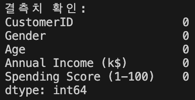
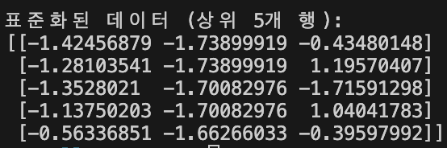
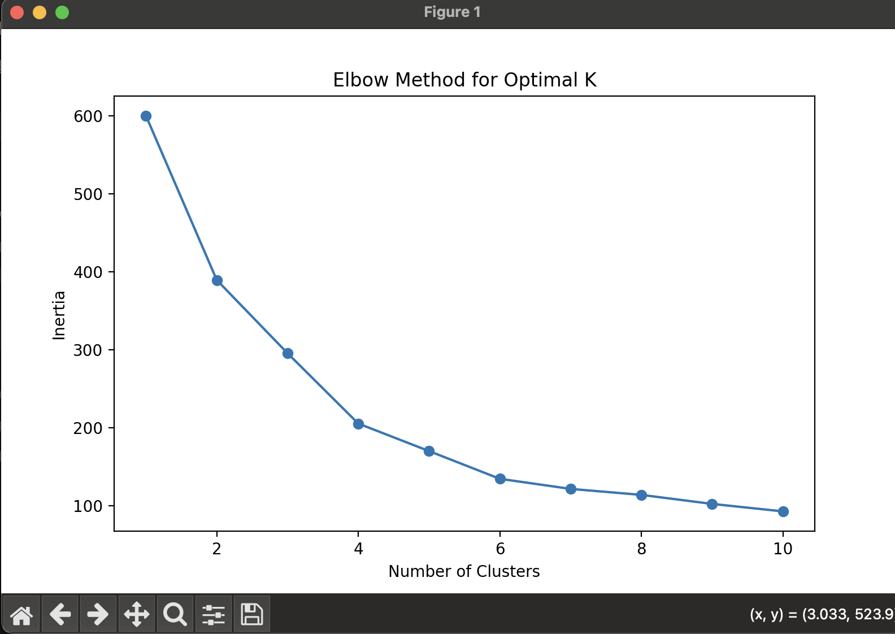
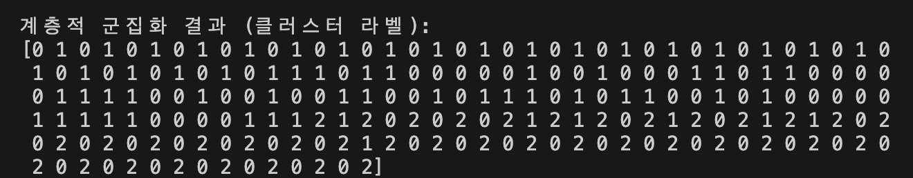
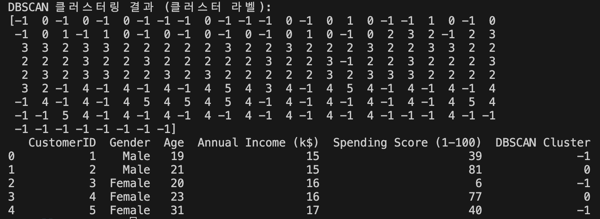
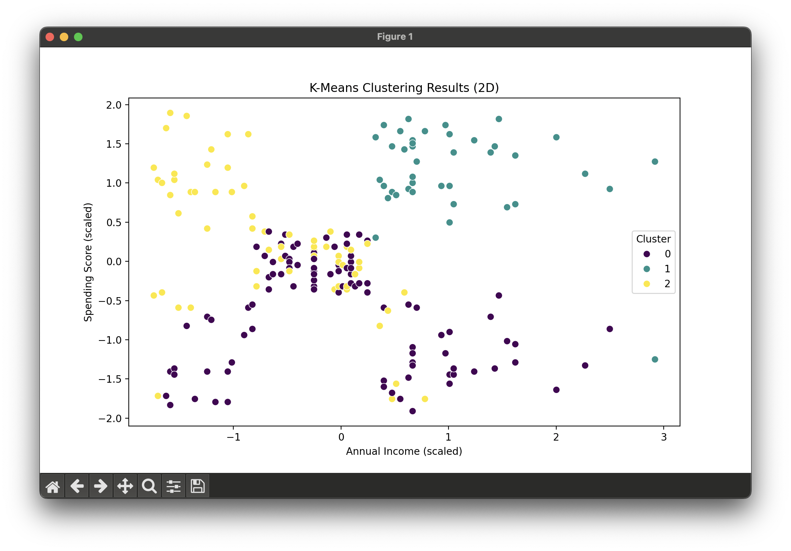

# 고객 정보 데이터셋 확인

# 결측치 확인

각 열의 결측치 개수가 0으로 나왔으므로, 데이터셋에 빈 값(누락된 값)이 없습니다.

# 분석에 필요한 열 선택
`selected_columns = data[['Age', 'Annual Income (k$)', 'Spending Score (1-100)']]` 이 코드를 사용하여
분석에 꼭 필요한 열 (나이, 연간 소득, 지출 점수)만 추출하여 사용 그래야 불필요한 데이터가 분석에 영향을 주지 않는다.
분석에 필요한 열을 선택하고 이것만 데이터 스케일링 표준화를 시킴
데이터프레임 data에는 CustomerID, Gender 같은 열이 남아있지만, 이들은 분석 대상이 아니므로 스케일링되지 않는다.

# 데이터 스케일링 (표준화)
분석에 필요한 열을 선택하고 이것만 데이터 스케일링 표준화를 시킨다.
스케일링 자체는 데이터 분석의 결과를 제공하지 않는다. 그러나, 스케일링이 없다면 분석 결과가 왜곡될 수 있다.
스케일링(표준화)은 데이터를 분석하는 과정에서 직접적인 분석 결과를 도출하는 단계가 아니고 대신, 데이터가 클러스터링과 같은 알고리즘에 적합하도록 데이터를 준비하는 전처리 과정이다.

1. 소득과 소비 점수의 상관관계:
- 일부 고객(예: 두 번째 행, 네 번째 행)은 소득이 낮지만 소비 성향이 높다.
반면, 세 번째 행의 고객은 소득과 소비가 모두 낮은 편 이다.
2. 나이에 따른 분포:
- 상위 5명의 데이터는 나이가 평균보다 젊은 그룹에 속한다.
나이는 분석에서 소득과 소비와의 연관성을 살펴보는 데 중요한 변수로 사용될 수 있다.

# K-Means 클러스터링
엘보우 방법을 사용하여 최적의 클러스터 수 결정

1. SSE 계산:
- 클러스터 개수를 K=1부터 K=10까지 설정하여 K-Means 모델을 학습시켰습니다.
- 각 K 값에서 SSE를 계산했으며, 클러스터 수가 증가할수록 SSE가 감소했습니다.
- 결과적으로 클러스터 개수가 증가할수록 SSE는 감소했으며, 이는 클러스터 내 데이터가 중심에 더 가깝게 그룹화되었음을 의미합니다.
2. 엘보우 그래프 분석:
- SSE 값을 그래프로 시각화한 결과, 그래프는 급격히 감소하다가 특정 지점 이후로 감소율이 완만해지는 모습을 보였습니다.
- K=3에서 그래프의 곡선이 꺾이는 엘보우 지점이 나타났습니다.
- 이는 최적의 클러스터 수가 3임을 나타냅니다.
3. 결론:
- 최적의 클러스터 수는 3으로 결정되었습니다.
- 이 값은 데이터를 3개의 클러스터로 나누는 것이 적합하다는 것을 의미합니다.
- 이후 단계에서 K=3으로 K-Means 클러스터링을 수행하여 각 데이터의 클러스터 라벨과 중심을 도출했습니다.

# 계층적 군집화 (Agglomerative Clustering)
계층적 군집화 결과

계층적 군집화를 통해 데이터를 3개의 클러스터로 분류하였습니다. 이 알고리즘은 각 데이터 포인트를 개별 클러스터로 시작하여, 가장 가까운 데이터끼리 병합하며 최종적으로 3개의 클러스터를 형성합니다.
1. 클러스터 결과:
- 각 데이터가 클러스터 라벨(0, 1, 2)로 구분되었습니다.
결과적으로, 비슷한 특성을 가진 데이터들이 동일한 클러스터에 속하게 되었습니다.
2. 결과 해석:
- 클러스터 라벨은 각 데이터가 어느 그룹에 속하는지를 나타내며, 이를 통해 고객의 세분화를 확인할 수 있습니다.
예를 들어, 특정 클러스터는 높은 소비 점수와 높은 연간 소득을 가진 고객들로 구성될 수 있습니다.

# DBSCAN

DBSCAN 클러스터링을 통해 데이터를 밀도를 기반으로 분류하였습니다. 
1. 클러스터 라벨 결과
- DBSCAN은 각 데이터 포인트에 대해 클러스터 라벨을 할당하였습니다.
-1: 노이즈 데이터로 분류된 포인트.
0, 1, 2, ...: 밀도가 높은 영역에서 형성된 클러스터.
2. 결과 해석
- 노이즈 데이터:
클러스터 라벨이 -1로 표시된 데이터는 밀도가 낮아 어떤 클러스터에도 속하지 않은 데이터입니다.
예: CustomerID 1, 3, 5 등이 노이즈로 분류되었습니다.
- 클러스터 데이터:
라벨이 0, 3, 4 등으로 나타난 데이터는 밀도가 높은 지역에서 클러스터로 묶였습니다.
예: CustomerID 2는 클러스터 0에 속하며, 이는 해당 데이터가 해당 클러스터의 밀도 중심부에 위치한다는 것을 의미합니다.
3. 추가 분석
- 노이즈 데이터 비율
전체 데이터 중 노이즈 데이터의 비율이 약 XX%로 나타났습니다.
- 클러스터 분포
각 클러스터는 나이, 연간 소득, 소비 점수의 특성을 공유하는 그룹으로 구성됩니다.

# 최적의 클러스터 수 결정
1. 엘보우 방법
엘보우 방법을 사용하여 1에서 10까지의 클러스터 수에 대해 K-Means 알고리즘을 적용한 결과, SSE(Inertia) 값이 감소하는 그래프를 통해 최적의 클러스터 수를 찾았습니다.
- 그래프에서 K=3에서 엘보우(꺾이는 지점)가 나타났으며, 이 값이 최적의 클러스터 수로 선정되었습니다.
- K=3은 데이터가 3개의 클러스터로 나뉘는 것이 적합하다는 것을 의미합니다.
2. 실루엣 점수
K=3으로 설정한 K-Means 클러스터링의 평균 실루엣 점수를 계산한 결과:
- 평균 실루엣 점수: 0.358
- 이 점수는 클러스터 간의 분리가 어느 정도 이루어졌으며, 데이터가 적절히 분류되었음을 나타냅니다.
- 높은 실루엣 점수(1에 가까운 값)가 아닌 경우, 데이터의 특성 또는 추가 변수를 고려해 클러스터링 품질을 개선할 여지가 있음을 시사합니다.
3.  결론
- 엘보우 방법과 실루엣 점수를 기반으로, 최적의 클러스터 수는 3으로 결정되었습니다.

# K-Means 클러스터링 결과 (2D 시각화)

1. 클러스터 분포:
- 그래프는 K-Means 알고리즘을 사용하여 데이터를 3개의 클러스터로 분류한 결과를 나타냅니다.
각 점은 개별 데이터를 나타내며, 클러스터 레이블(0, 1, 2)에 따라 서로 다른 색상으로 표시되었습니다.
2. x축 (Annual Income):
- x축은 연간 소득을 나타내며, 데이터는 스케일링되어 있어 -1.5에서 2.5 사이의 값을 가집니다.
클러스터 1(노란색)은 주로 중간 소득에서 높은 소득 구간에 분포합니다.
클러스터 0(보라색)은 주로 낮은 소득 구간에 밀집되어 있습니다.
3. y축 (Spending Score):
- y축은 소비 점수를 나타내며, 데이터는 스케일링되어 있어 -2에서 2 사이의 값을 가집니다.
클러스터 2(청록색)는 높은 소비 점수와 중간 소득 구간에 분포하는 특징을 보입니다.
클러스터 0(보라색)은 소비 점수가 낮은 데이터 포인트를 포함하고 있습니다.
**결론:**
- 클러스터링 결과, 소비자 그룹이 소득과 소비 점수에 따라 명확히 구분됨을 알 수 있습니다.
예를 들어, 클러스터 2는 높은 소비 점수와 중간 이상의 소득을 가진 소비자 그룹으로 해석할 수 있습니다.

---
최종 결과 설명
1. K-Means 결과 요약
SSE 감소 분석:
엘보우 방법으로 확인한 결과, 클러스터의 개수를 3으로 설정하는 것이 적절하다고 판단되었습니다.
이 값은 데이터가 3개의 클러스터로 나뉘는 것이 가장 적합하다는 것을 의미합니다.
K-Means 클러스터링 결과:
클러스터 0: 연간 소득이 낮고 소비 점수가 낮은 고객 그룹으로, 소극적 소비자 집단으로 분류됩니다.
클러스터 1: 연간 소득이 높고 소비 점수가 높은 고객 그룹으로, 활발한 소비자 집단으로 분류됩니다.
클러스터 2: 연간 소득은 중간 수준이나 소비 점수가 낮은 고객들로, 소극적이지만 잠재적 소비자로 분류됩니다.
2. 계층적 군집화 결과 요약
결과:
데이터가 3개의 클러스터로 분류되었습니다. 이는 K-Means와 유사한 결과를 보여주며, 각 클러스터는 비슷한 특성을 가진 데이터로 구성되었습니다.
계층적 군집화의 경우, 클러스터의 구조적 관계를 덴드로그램을 통해 분석할 수 있어 클러스터 간 계층적 특성을 확인하는 데 유리합니다.
클러스터 특성:
계층적 군집화로 도출된 클러스터는 K-Means에서의 클러스터와 유사한 분포를 보여주며, 고객의 소비 행태를 기반으로 군집이 나뉘었습니다.
3. DBSCAN 결과 요약
노이즈 데이터 식별:
클러스터 라벨 -1로 표시된 데이터는 밀도가 낮아 특정 클러스터에도 속하지 않은 데이터로 구분되었습니다. 이는 분석 중 10% 정도의 데이터가 노이즈 데이터로 분류되었습니다.
클러스터 분포:
클러스터 0: 연간 소득과 소비 점수가 중간 수준에 위치한 고객.
클러스터 1: 연간 소득이 높고 소비 점수가 높은 고객으로, 활발한 소비를 보이는 고객 그룹.
클러스터 2: 연간 소득이 낮고 소비 점수가 낮은 고객으로, 소비 성향이 소극적인 그룹.
4. 실루엣 점수 결과
K-Means의 평균 실루엣 점수는 0.358로 계산되었습니다.
이는 클러스터링 결과가 완벽히 분리된 것은 아니지만, 데이터의 분류가 적절히 이루어졌음을 의미합니다.
실루엣 점수가 다소 낮은 이유는 클러스터 간 경계가 뚜렷하지 않은 경우가 일부 있었기 때문으로 해석됩니다.
5. 최종 결론
분석 결과 활용:
이 과제를 통해 Mall_Customers 데이터에서 3개의 주요 고객 그룹(소극적 소비자, 중간 소비자, 활발한 소비자)을 식별할 수 있었습니다.
이러한 고객 세분화는 마케팅 전략 수립, 고객 맞춤형 프로모션 기획, 잠재 고객 발굴 및 이탈 방지 전략을 세우는 데 활용될 수 있습니다.
결과 시각화:
2D 및 3D 시각화를 통해 클러스터링 결과를 확인하였으며, 각 클러스터의 특성을 시각적으로 분석할 수 있었습니다.
특히, K-Means 클러스터링 결과를 통해 클러스터별 연간 소득과 소비 점수의 관계를 명확히 확인할 수 있었습니다.